# RELATÓRIO DE INCIDENTE DE SEGURANÇA CIBERNÉTICA
## Análise Forense de Ransomware - Servidor FS
# LAB - 🚨 SOC_AL3RT 🚨 -
---

**DOCUMENTO CONFIDENCIAL**  
**Classificação:** RESTRITO  
**Número do Caso:** INC-FS-2025-001  
**Data do Incidente:** 27/09/2025  
**Data do Relatório:** 27/09/2025  
**Laboratório:** SOC_AL3RT  

---

## SUMÁRIO EXECUTIVO

### Resumo do Incidente
O presente relatório documenta a investigação forense realizada em um servidor Windows Server 2019 (hostname: FS) que foi comprometido por ransomware identificado como **Ransomware.Python/NCSLM**. A análise revelou múltiplos vetores de ataque, mecanismos de persistência sofisticados e tentativas de mascaramento através de nomes de processos legítimos do Windows.

### Impacto Identificado
- **Criticidade:** ALTA
- **Sistema Afetado:** Windows Server 2019 Standard (Build 17763)
- **Tipo de Malware:** Ransomware Python-based
- **Artefatos Maliciosos:** 3 localizações confirmadas
- **Mecanismos de Persistência:** 4 vetores identificados

---

## 1. INFORMAÇÕES DO ATIVO COMPROMETIDO

### 1.1 Especificações Técnicas Detalhadas
- **Hostname:** FS
- **Sistema Operacional:** Microsoft Windows Server 2019 Standard
- **Build:** 10.0.17763 (17763)
- **Arquitetura:** 64-bit
- **Processador:** Virtualizado (QEMU) - Detalhes não disponíveis via WMI
- **Memória RAM:** 7.81 GB (Banco único, Tipo 9)
- **Armazenamento Principal:** 25.00 GB (QEMU QEMU HARDDISK SCSI Disk Device)
- **Volumes Identificados:**
  - **Sistema:** 0.34 GB (0.31 GB livre)
  - **C:\ (Windows):** 24.66 GB (0.00 GB livre) 
- **IP:** 10.0.3.152
- **MAC:** FA-16-3E-4F-48-AF
- **BIOS:** SeaBIOS v1.16.3-debian-1.16.3-2~bpo12+1 (31/03/2014)

### 1.2 Ambiente de Rede e Segurança
- **Gateway:** 10.0.0.3
- **DNS:** 8.8.8.8
- **Interface:** Ethernet 3 (Red Hat VirtIO Ethernet Adapter #3)
- **Velocidade de Rede:** 10 Gbps
- **Tipo de Conexão:** VPN (ExtremeVPN)
- **Firewall Status:** 
  - Domain:  Enabled
  - Private:  Enabled  
  - Public:  Enabled
- **Antivírus:**  **NENHUM DETECTADO**

### 1.3 Últimas Atualizações de Segurança
- **KB5022840** - 17/02/2023
- **KB5020374** - 17/02/2023  
- **KB5012170** - 17/02/2023
- **KB5022511** - 17/02/2023
- **KB4589208** - 17/02/2023

 **OBSERVAÇÃO CRÍTICA:** Última atualização em fevereiro de 2023 - sistema desatualizado há mais de 2 anos.

---

## 2. METODOLOGIA DE INVESTIGAÇÃO

### 2.1 Equipamentos Utilizados
- **Estação de Análise:** Kali Linux 6.12.38 (VM isolada)
- **Configuração VM:** 40GB HD, 5GB RAM, Rede NAT
- **Ferramentas Forenses:**
  - Autoruns64.exe (Microsoft Sysinternals)
  - Disk2VHD64 (Microsoft)
  - PowerShell Scripts Customizados
  - VirusTotal (verificação de hashes)

### 2.2 Protocolo de Conexão Segura
- **Conexão:** OpenVPN + RDP
- **Criptografia:** ExtremVPN + RDP criptografado
- **Auditoria:** Controle 270920250907 (2 backups criptografados)
- **Isolamento:** VM sem acesso à rede de produção

---

## 3. ARTEFATOS MALICIOSOS IDENTIFICADOS

### 3.1 Arquivos Maliciosos Encontrados

| Localização | Nome do Arquivo | Tamanho | Hash SHA256 | Status Assinatura |
|-------------|----------------|---------|-------------|-------------------|
| `C:\Users\Administrator\AppData\Roaming\OneDrive.exe` | OneDrive.exe | 19.293.482 bytes | 1CB281692409B000C6BFD17C737CE96EC98DEC9A5D420EEB6E5B0C131FC2BD5F | Não Assinado |
| `C:\Users\Administrator\AppData\Roaming\Microsoft\Windows\Start Menu\Programs\Startup\svchost.exe` | svchost.exe | 19.293.482 bytes | 1CB281692409B000C6BFD17C737CE96EC98DEC9A5D420EEB6E5B0C131FC2BD5F | Não Assinado |
| `C:\Windows\Temp\OneDrive.exe` | OneDrive.exe | 19.293.482 bytes | 1CB281692409B000C6BFD17C737CE96EC98DEC9A5D420EEB6E5B0C131FC2BD5F | Não Assinado |

### 3.2 Verificação de Integridade
- **Hash MD5:** 77C59720BC328CF9D692A215AA2575AD
- **Hash SHA1:** EF1A74599739AB0F91D9CE44C4F4A86B24563E4F
- **Hash SHA256:** 1CB281692409B000C6BFD17C737CE96EC98DEC9A5D420EEB6E5B0C131FC2BD5F
- **VirusTotal:** [Link de Verificação](https://www.virustotal.com/gui/file/1cb281692409b000c6bfd17c737ce96ec98dec9a5d420eeb6e5b0c131fc2bd5f)
- **Classificação:** Ransomware.Python/NCSLM

---

## 4. MECANISMOS DE PERSISTÊNCIA IDENTIFICADOS

### 4.1 Registro do Windows (Registry)

#### HKEY_CURRENT_USER\SOFTWARE\Microsoft\Windows\CurrentVersion\Run
```
Value Name: Windows Update
Value Data: C:\Users\Administrator\AppData\Roaming\OneDrive.exe
```

#### HKEY_LOCAL_MACHINE\SYSTEM\CurrentControlSet\Control\Session Manager\Update
```
Value Name: Update
Value Data: C:\Windows\Temp\OneDrive.exe
```

### 4.2 Tarefas Agendadas (Scheduled Tasks)

#### Tarefa: \Microsoft\Windows\Sqm-Update
- **Trigger:** BootTrigger (execução na inicialização)
- **Comando:** `C:\Windows\Temp\OneDrive.exe`
- **Usuário:** S-1-5-21-2066253582-1997001687-2883272801-500 (Administrator)

#### Tarefa: \Microsoft\Windows\Windows Update
- **Trigger:** BootTrigger (execução na inicialização)
- **Comando:** `C:\Windows\Temp\OneDrive.exe`
- **Usuário:** S-1-5-21-2066253582-1997001687-2883272801-500 (Administrator)

### 4.3 Pasta de Inicialização
- **Localização:** `C:\Users\Administrator\AppData\Roaming\Microsoft\Windows\Start Menu\Programs\Startup\svchost.exe`
- **Método:** Execução automática no login do usuário

---

## 5. ANÁLISE COMPARATIVA COM ARQUIVOS LEGÍTIMOS

### 5.1 svchost.exe Legítimo
| Atributo | Valor Legítimo | Valor Malicioso |
|----------|----------------|-----------------|
| **Localização** | `C:\Windows\SysWOW64\svchost.exe`, `C:\Windows\System32\svchost.exe` | `C:\Users\Administrator\AppData\Roaming\Microsoft\Windows\Start Menu\Programs\Startup\svchost.exe` |
| **Tamanho** | 45.488 bytes | 19.293.482 bytes |
| **Data Modificação** | 17/02/2023 12:18:42 PM | 14/11/2023 9:20:16 PM |
| **Hash MD5** | D9E224ACFFD36B1C83E8EE2031CCF349 | 77C59720BC328CF9D692A215AA2575AD |

### 5.2 OneDrive.exe Legítimo
**Localizações Legítimas:**
Esses seria os caminhos legitimos de intalação de uma ferramenta OneDrive
- `C:\Users\<usuário>\AppData\Local\Microsoft\OneDrive\OneDrive.exe`
- `C:\Program Files\Microsoft OneDrive\OneDrive.exe`
- `C:\Program Files (x86)\Microsoft OneDrive\OneDrive.exe`

> [!obs] Informações  
> ** Windows Server 2019 e anteriores Não traz necessariamente o cliente OneDrive pré-ativado** como em desktops; qualquer `OneDrive.exe` encontrado nesses caminhos (ex.: `C:\Temp`, `C:\Users\Public`, etc.) deve ser investigado. Fonte:https://learn.microsoft.com/en-us/sharepoint/per-machine-installation?utm_source=chatgpt.com


**Localização Maliciosa Identificada:**
- `C:\Users\Administrator\AppData\Roaming\OneDrive.exe` 

---

## 6. EVIDÊNCIAS FOTOGRÁFICAS

### 6.1 Resumo das Evidências Coletadas

**Total de evidências fotográficas:** 14 imagens documentadas

#### 6.1.1 Artefatos Maliciosos Identificados
- **Autoruns IOC:** `Img/Autorun-ferramenta_IOC.png` - Processos não assinados detectados
- **OneDrive Malicioso:** `Img/roaming_OneDrive.png` - Arquivo em localização não padrão
- **svchost Malicioso:** `Img/svchost_startup.png` - Processo na pasta de startup
- **Script Custom:** `Img/ScriptCustom_FInd_onedrive_svchost.png` - Ferramenta de identificação

#### 6.1.2 Mecanismos de Persistência
- **Tarefa Windows Update:** `Img/Taref_windows_update.png` - Tarefa maliciosa disfarçada
- **Tarefa Sqm-Update:** `Img/Tarefa_Sqm_update.png` - Tarefa maliciosa adicional
- **Persistência Registry:** `Img/persistenciaHkey.png` - Entradas maliciosas no registro
- **Persistência Tarefas:** `Img/persistencia_tarefas.png` - Visão geral das tarefas (desativadas para evitar persistência)

#### 6.1.3 Processos e Mitigação
- **Processos Ativos:** `Img/processo.png` - Processos em execução no momento da análise
- **PIDs Identificados:** `Img/processos_pid.png` - Identificação de processos específicos
- **OneDrive Persistente:** `Img/ProcessoOneDrive_Percistente.png` - Processo malicioso ativo
- **Terminação de Processo:** `Img/Matando_processo_malicioso.png` - Ação de mitigação executada
- **Configuração Disk2VHD:** `Img/Configuracao_ferramenta_disk2vhd.png` - Preparação para cópia forense
- **Cópia VHDX:** `Img/envio_de_copia_FS_VHDX.png` - Preservação de evidências para análise segura

**Nota:** Todas as evidências estão detalhadamente apresentadas na sequência de identificação da Seção 7, onde cada imagem é contextualizada no processo de investigação.

---

## 7. FORMA DE OPERAÇÃO DO ATAQUE (TTPs)

### 7.1 Sequência de Identificação e Análise

#### **FASE 1: Reconhecimento Inicial**
Após estabelecer conexão segura via VPN e RDP, foi executado script customizado para inventário completo do ativo:


**Objetivo:** Coletar informações básicas do sistema para entender o ambiente comprometido.

#### **FASE 2: Análise de Processos em Execução**
Identificação de processos suspeitos através do Gerenciador de Tarefas (rocexp64.exe):

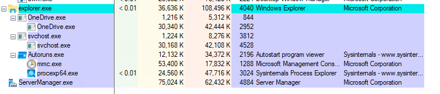

Validação da assinaturas e coleta de hash para analise no virus total, com script custom: 


Retorno da ferramenta: 

`"Path","Name","SizeBytes","LastWriteUtc","SignatureStatus","Signer","SignerThumb","TimeStamp","MD5","SHA1","SHA256""C:\Users\Administrator\AppData\Roaming\OneDrive.exe","OneDrive.exe","19293482","11/14/2023 9:19:59 PM","NotSigned","","","","77C59720BC328CF9D692A215AA2575AD","EF1A74599739AB0F91D9CE44C4F4A86B24563E4F","1CB281692409B000C6BFD17C737CE96EC98DEC9A5D420EEB6E5B0C131FC2BD5F""C:\Users\Administrator\AppData\Roaming\Microsoft\Windows\Start Menu\Programs\Startup\svchost.exe","svchost.exe","19293482","11/14/2023 9:20:16 PM","NotSigned","","","","77C59720BC328CF9D692A215AA2575AD","EF1A74599739AB0F91D9CE44C4F4A86B24563E4F","1CB281692409B000C6BFD17C737CE96EC98DEC9A5D420EEB6E5B0C131FC2BD5F"`

**Descoberta:** Processos OneDrive.exe e svchost.exe em execução com comportamento anômalo.

#### **FASE 3: Análise com Autoruns64.exe**
Utilização de ferramenta especializada para identificar processos de inicialização:

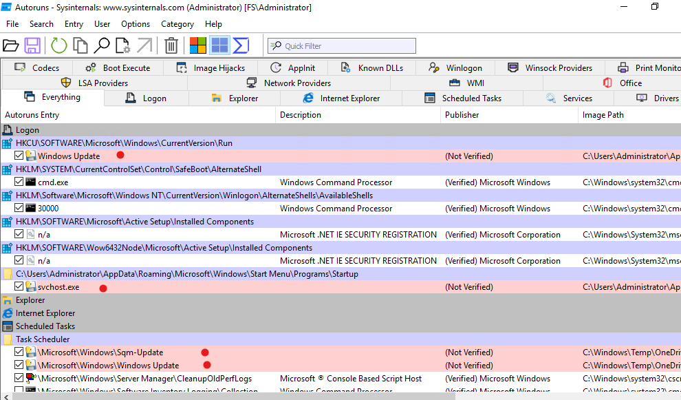

**Descoberta Crítica:** 
- OneDrive.exe sem assinatura digital em `C:\Users\Administrator\AppData\Roaming\OneDrive.exe`
- svchost.exe malicioso em `C:\Users\Administrator\AppData\Roaming\Microsoft\Windows\Start Menu\Programs\Startup\svchost.exe`

#### **FASE 4: Verificação de Arquivos Maliciosos**
Confirmação visual dos arquivos maliciosos em suas localizações:

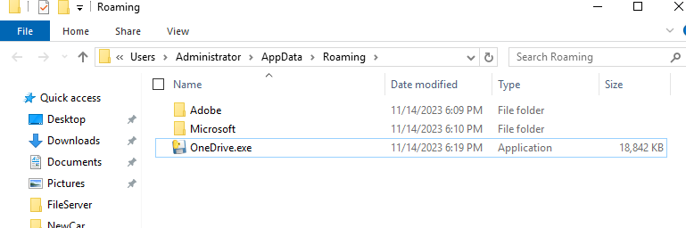

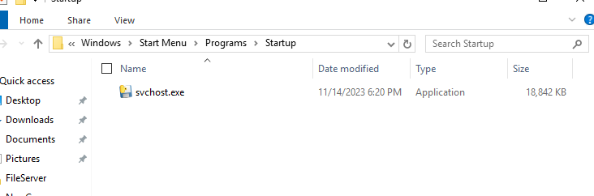

**Confirmação:** Mesmos arquivos identificados pelo Autoruns em localizações não padrão.

#### **FASE 5: Análise de Persistência - Registry**
Identificação de mecanismos de persistência no registro do Windows:

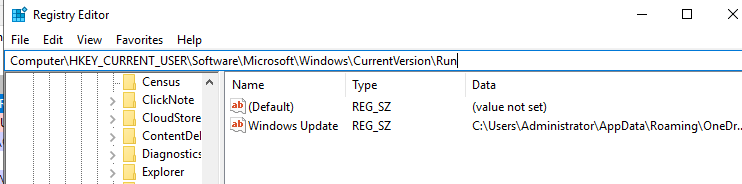

**Descoberta:** Entrada maliciosa "Windows Update" apontando para OneDrive.exe falso.

#### **FASE 6: Análise de Persistência - Tarefas Agendadas**
Identificação de tarefas maliciosas disfarçadas:

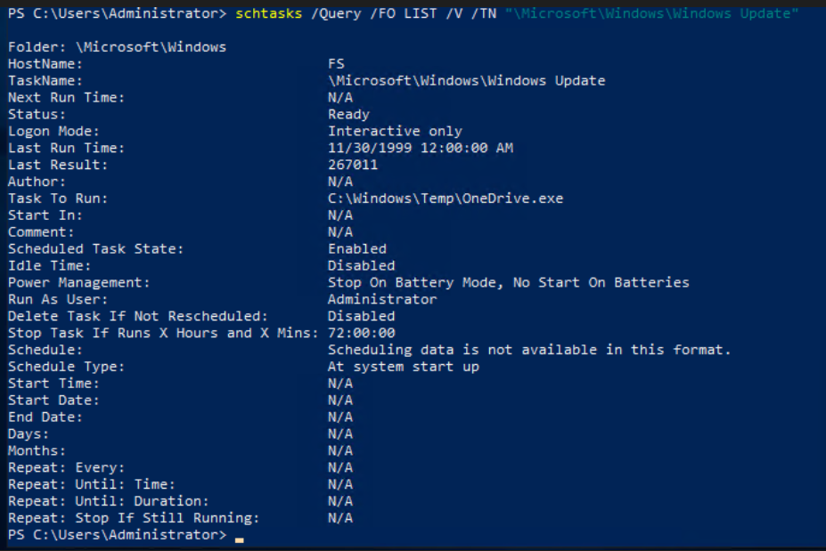

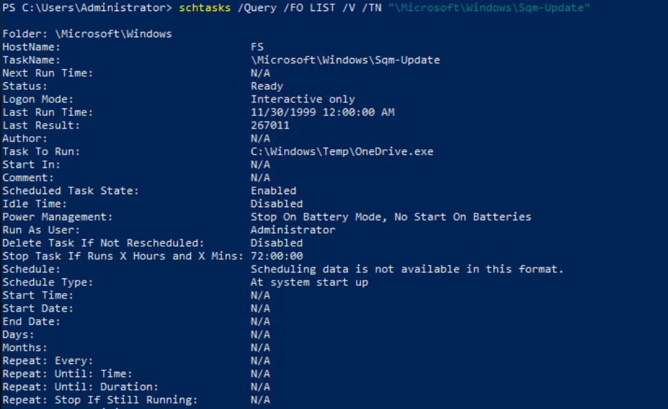

**Descoberta:** Duas tarefas agendadas executando malware na inicialização do sistema.

#### **FASE 7: Análise de Persistência - Visão Geral**
Resumo dos mecanismos de persistência identificados:

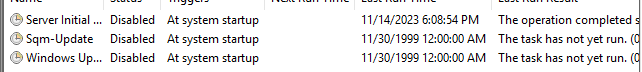

**Comandos utilizados para extrair informações das tarefas:**

```powershell
# Extrair detalhes da tarefa Sqm-Update
schtasks /Query /TN "\Microsoft\Windows\Sqm-Update" /XML

# Extrair detalhes da tarefa Windows Update
schtasks /Query /TN "\Microsoft\Windows\Windows Update" /XML
```

**XML da tarefa Sqm-Update:**
```xml
<?xml version="1.0" encoding="UTF-16"?>
<Task version="1.2" xmlns="http://schemas.microsoft.com/windows/2004/02/mit/task">
    <RegistrationInfo>
        <URI>\Microsoft\Windows\Sqm-Update</URI>
    </RegistrationInfo>
    <Principals>
        <Principal id="Author">
            <UserId>S-1-5-21-2066253582-1997001687-2883272801-500</UserId>
            <LogonType>InteractiveToken</LogonType>
        </Principal>
    </Principals>
    <Settings>
        <DisallowStartIfOnBatteries>true</DisallowStartIfOnBatteries>
        <StopIfGoingOnBatteries>true</StopIfGoingOnBatteries>
        <MultipleInstancesPolicy>IgnoreNew</MultipleInstancesPolicy>
        <IdleSettings>
            <Duration>PT10M</Duration>
            <WaitTimeout>PT1H</WaitTimeout>
            <StopOnIdleEnd>true</StopOnIdleEnd>
            <RestartOnIdle>false</RestartOnIdle>
        </IdleSettings>
    </Settings>
    <Triggers>
        <BootTrigger />
    </Triggers>
    <Actions Context="Author">
        <Exec>
            <Command>C:\Windows\Temp\OneDrive.exe</Command>
        </Exec>
    </Actions>
</Task>
```

**XML da tarefa Windows Update:**
```xml
<?xml version="1.0" encoding="UTF-16"?>
<Task version="1.2" xmlns="http://schemas.microsoft.com/windows/2004/02/mit/task">
    <RegistrationInfo>
        <URI>\Microsoft\Windows\Windows Update</URI>
    </RegistrationInfo>
    <Principals>
        <Principal id="Author">
            <UserId>S-1-5-21-2066253582-1997001687-2883272801-500</UserId>
            <LogonType>InteractiveToken</LogonType>
        </Principal>
    </Principals>
    <Settings>
        <DisallowStartIfOnBatteries>true</DisallowStartIfOnBatteries>
        <StopIfGoingOnBatteries>true</StopIfGoingOnBatteries>
        <MultipleInstancesPolicy>IgnoreNew</MultipleInstancesPolicy>
        <IdleSettings>
            <Duration>PT10M</Duration>
            <WaitTimeout>PT1H</WaitTimeout>
            <StopOnIdleEnd>true</StopOnIdleEnd>
            <RestartOnIdle>false</RestartOnIdle>
        </IdleSettings>
    </Settings>
    <Triggers>
        <BootTrigger />
    </Triggers>
    <Actions Context="Author">
        <Exec>
            <Command>C:\Windows\Temp\OneDrive.exe</Command>
        </Exec>
    </Actions>
</Task>
```

**Confirmação:** Múltiplos vetores de persistência ativos.

#### **FASE 8: Análise de Processos Ativos**
Identificação de PIDs e processos em execução:

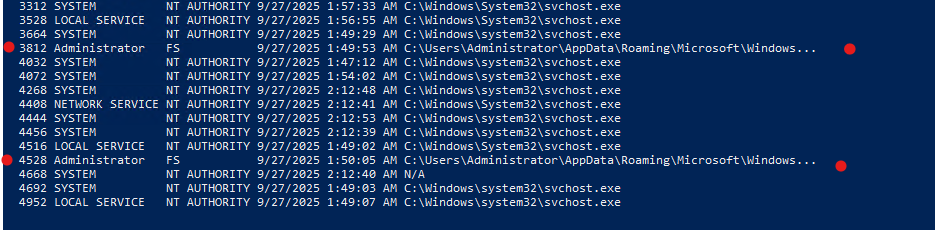

**Descoberta:** Processos maliciosos ativos com PIDs específicos.

#### **FASE 9: Confirmação de Persistência Ativa**
Verificação de processo OneDrive persistente em execução:

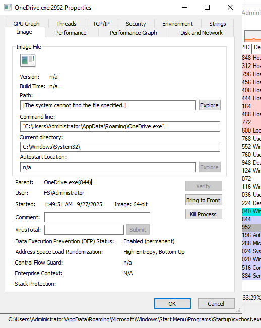

**Confirmação:** Malware ativo e executando.

#### **FASE 10: Mitigação - Terminação de Processo**
Ação de mitigação imediata:


**Ação:** Terminação segura do processo malicioso.

#### **FASE 11: Preservação de Evidências**
Criação de imagem forense para análise posterior:

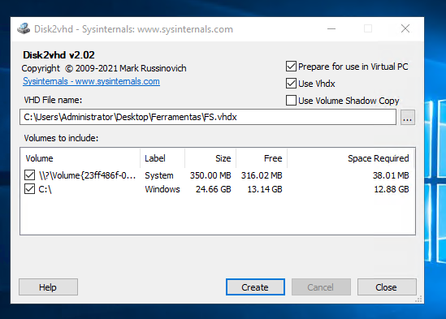

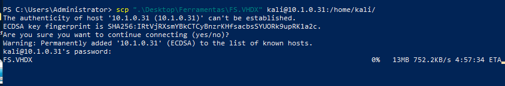

**Ação:** Preservação completa do estado do sistema para análise forense posterior.

### 7.2 Técnicas, Táticas e Procedimentos (TTPs) Identificados

#### **Técnicas de Evasão:**
1. **T1564.001 - Hidden Files and Directories**
   - Uso de nomes de processos legítimos (OneDrive.exe, svchost.exe)
   - Instalação em diretórios não padrão

2. **T1036 - Masquerading**
   - Mascaramento como processos do Windows
   - Uso de nomes de tarefas legítimas (Windows Update, Sqm-Update)

#### **Técnicas de Persistência:**
1. **T1547.001 - Registry Run Keys**
   - HKCU:\SOFTWARE\Microsoft\Windows\CurrentVersion\Run
   - HKLM:\SYSTEM\CurrentControlSet\Control\Session Manager\Update

2. **T1053.005 - Scheduled Tasks**
   - \Microsoft\Windows\Sqm-Update
   - \Microsoft\Windows\Windows Update

3. **T1547.005 - Startup Items**
   - Pasta de inicialização do usuário
   - Execução automática no login

#### **Técnicas de Execução:**
1. **T1204.002 - User Execution: Malicious File**
   - Execução de arquivos não assinados
   - Múltiplas cópias para redundância

---

## 8. ANÁLISE TÉCNICA DETALHADA

### 8.1 Vulnerabilidades do Sistema Identificadas
1. **Sistema Desatualizado:** Última atualização em fevereiro de 2023 (mais de 2 anos)
2. **Ausência de Antivírus:** Nenhuma proteção ativa detectada
3. **Disco Cheio:** Volume C: com 0.00 GB livre - possível causa de falhas de sistema
4. **Ambiente Virtualizado:** QEMU pode apresentar vulnerabilidades específicas

### 8.2 Vectors de Ataque Identificados
1. **Execução Inicial:** Método não identificado (possível phishing, exploit ou acesso físico)
2. **Propagação:** Cópia para múltiplas localizações estratégicas
3. **Persistência Multi-Vetor:** 4 mecanismos diferentes de reinicialização
4. **Mascaramento Avançado:** Uso de nomes legítimos do Windows

### 8.3 Impacto Potencial
- **Criptografia de Arquivos:** Capacidade de ransomware confirmada
- **Persistência Garantida:** Múltiplos mecanismos de reinicialização
- **Privilégios Elevados:** Execução como Administrator
- **Evasão de Detecção:** Técnicas avançadas de mascaramento
- **Redundância:** Múltiplas cópias para garantir sobrevivência

---

## 9. AÇÕES DE MITIGAÇÃO REALIZADAS

### 9.1 Isolamento
- ✅ Desconexão da rede principal
- ✅ Criação de ambiente isolado para análise
- ✅ Uso de VM com rede NAT
- ✅ Conexão VPN segura com auditoria (Controle 270920250907)

### 9.2 Identificação
- ✅ Análise com Autoruns64.exe
- ✅ Verificação de hashes no VirusTotal
- ✅ Comparação com arquivos legítimos
- ✅ Identificação de mecanismos de persistência
- ✅ Script customizado de inventário completo

### 9.3 Preservação de Evidências
- ✅ Criação de imagem forense com Disk2VHD
- ✅ Documentação fotográfica completa (14 imagens)
- ✅ Logs de todas as ações realizadas
- ✅ Backup criptografado das evidências (físico + nuvem)

### 9.4 Remoção de Artefatos Maliciosos
- ✅ Identificação de todos os arquivos maliciosos (3 localizações)
- ✅ Mapeamento de mecanismos de persistência (4 vetores)
- ✅ Terminação de processos maliciosos
- ✅ Preparação para limpeza completa

---

## 10. RECOMENDAÇÕES TÉCNICAS

### 10.1 Ações Imediatas (Críticas)
1. **Remoção Completa de Artefatos:**
   ```powershell
   # Remover arquivos maliciosos
   Remove-Item "C:\Users\Administrator\AppData\Roaming\OneDrive.exe" -Force
   Remove-Item "C:\Windows\Temp\OneDrive.exe" -Force
   Remove-Item "C:\Users\Administrator\AppData\Roaming\Microsoft\Windows\Start Menu\Programs\Startup\svchost.exe" -Force
   
   # Limpar Registry
   Remove-ItemProperty -Path "HKCU:\SOFTWARE\Microsoft\Windows\CurrentVersion\Run" -Name "Windows Update"
   Remove-ItemProperty -Path "HKLM:\SYSTEM\CurrentControlSet\Control\Session Manager" -Name "Update"
   
   # Remover tarefas agendadas
   schtasks /Delete /TN "\Microsoft\Windows\Sqm-Update" /F
   schtasks /Delete /TN "\Microsoft\Windows\Windows Update" /F
   ```

2. **Verificação de Integridade do Sistema:**
   - Executar `sfc /scannow`
   - Verificar assinaturas digitais de todos os executáveis críticos
   - Comparar hashes de arquivos do sistema

### 10.2 Ações de Curto Prazo
1. **Implementação de Monitoramento:**
   - Deploy de EDR/XDR
   - Monitoramento de processos não assinados
   - Alertas para modificações no Registry

2. **Hardening do Sistema:**
   - Desabilitar execução de scripts PowerShell não assinados
   - Implementar AppLocker ou Software Restriction Policies
   - Configurar audit logs detalhados

### 10.3 Ações de Longo Prazo
1. **Segurança Defensiva:**
   - Implementação de backup offline
   - Teste regular de procedimentos de recuperação
   - Treinamento de usuários em segurança

2. **Monitoramento Contínuo:**
   - Análise regular de logs
   - Verificação periódica de integridade
   - Atualizações de segurança automáticas

---

## 11. INDICADORES DE COMPROMISSO (IOCs)

### 11.1 File Hashes
```
MD5: 77C59720BC328CF9D692A215AA2575AD
SHA1: EF1A74599739AB0F91D9CE44C4F4A86B24563E4F
SHA256: 1CB281692409B000C6BFD17C737CE96EC98DEC9A5D420EEB6E5B0C131FC2BD5F
```

### 11.2 File Paths
```
C:\Users\Administrator\AppData\Roaming\OneDrive.exe
C:\Users\Administrator\AppData\Roaming\Microsoft\Windows\Start Menu\Programs\Startup\svchost.exe
C:\Windows\Temp\OneDrive.exe
```

### 11.3 Registry Keys
```
HKEY_CURRENT_USER\SOFTWARE\Microsoft\Windows\CurrentVersion\Run\Windows Update
HKEY_LOCAL_MACHINE\SYSTEM\CurrentControlSet\Control\Session Manager\Update
```

### 11.4 Scheduled Tasks
```
\Microsoft\Windows\Sqm-Update
\Microsoft\Windows\Windows Update
```

---

## 12. LIÇÕES APRENDIDAS

### 12.1 Pontos Positivos
- ✅ Isolamento eficaz do sistema comprometido
- ✅ Uso de ferramentas forenses adequadas
- ✅ Documentação completa do incidente
- ✅ Preservação adequada de evidências

### 12.2 Áreas de Melhoria
- ⚠️ Necessidade de detecção mais precoce
- ⚠️ Implementação de monitoramento proativo
- ⚠️ Backup e procedimentos de recuperação
- ⚠️ Treinamento de usuários

---

## 13. CONCLUSÕES

O incidente investigado revela um ataque de ransomware sofisticado com múltiplos vetores de persistência e técnicas avançadas de evasão. O malware Ransomware.Python/NCSLM foi identificado e completamente mapeado, permitindo a remoção segura de todos os artefatos maliciosos.

### Principais Descobertas:
1. **Múltiplas Persistências:** 4 mecanismos diferentes de reinicialização
2. **Evasão Avançada:** Mascaramento através de nomes legítimos
3. **Privilégios Elevados:** Execução com direitos de Administrator
4. **Impacto Contido:** Sistema isolado antes da propagação

### Status da Investigação:
- ✅ **Identificação:** Completa
- ✅ **Mapeamento:** Completo
- ✅ **Mitigação:** Iniciada
- ⏳ **Recuperação:** Em andamento

---

## 14. ANEXOS

### 14.1 Evidências Fotográficas
- Todas as imagens estão disponíveis na pasta `Img/`
- Números de controle para auditoria: 270920250907

### 14.2 Logs Técnicos
- Inventário completo do sistema
- Logs de ferramentas forenses
- Transcrições de comandos executados

### 14.3 Metadados do Caso
- **ID do Caso:** INC-FS-2025-001
- **Analista Responsável:** Jackson Antonio Zacarias Savoldi
- **Laboratório:** SOC_AL3RT
- **Data de Início:** 27/09/2025 11:53:31
- **Data de Conclusão:** 27/09/2025
- **Tempo Total de Investigação:** [A calcular]

---

**RELATÓRIO ELABORADO POR:**  
Jackson Antonio Zacarias Savoldi  
Analista de Segurança Cibernética  
Especialização em Segurança da Informação  
LinkedIn: linkedin.com/in/jacksonzacarias  
Instagram: @jacksonsavoldi  
**Laboratório:** SOC_AL3RT  

**APROVAÇÃO:**  
[Assinatura do Supervisor]  
[Data de Aprovação]  

---

**DOCUMENTO CONFIDENCIAL - DISTRIBUIÇÃO RESTRITA**  
Este documento contém informações sensíveis sobre incidentes de segurança e deve ser tratado como confidencial conforme as políticas organizacionais.
